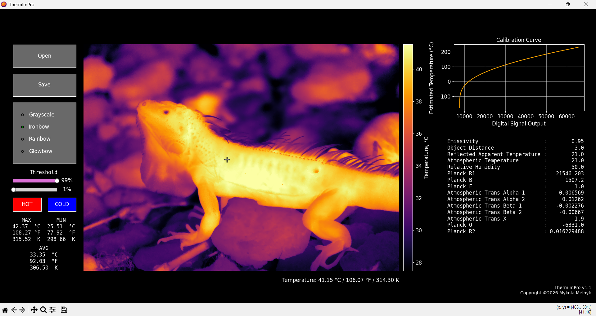

# ThermImPro (Thermal Image Processing)

A Python GUI tool for loading, viewing, and analyzing radiometric thermal images.

## Features

- Load radiometric thermal images from FLIR cameras
- View temperature values on hover
- Switch between four available color palettes
- Adjust color limits dynamically
- Detect and display hot and cold spots
- Display maximum, minimum, and average temperatures
- Save images with applied color palette
- Show calibration curve and metadata

## Requirements

- Python 3.10+
- ExifTool (command-line tool for metadata extraction)

Install Python and run the following command in a terminal or command prompt to install the required packages.

```
python -m pip install -r requirements.txt
```

### Windows

Download and install ExifTool from the [link below](#references).

Alternatively, if you have WinGet installed:

```
winget install exiftool
```

**Note:** Ensure `exiftool` is added to your PATH environment variable.

### Linux

Install ExifTool using one of the following commands.

Ubuntu/Debian:

```
sudo apt install libimage-exiftool-perl python3-tk
```

Arch Linux:

```
sudo pacman -S tk perl-image-exiftool
```

## Usage

To run ThermImPro, simply open and run the `main.py` source code file. This will open a dialog window where you can select a radiometric thermal image to load. Once the image is loaded, the GUI will appear, as shown in the image below.



By hovering over the image, you can see the temperature at that point in Celsius, Fahrenheit and Kelvin.

You can choose from the grayscale, ironbow, rainbow, and glowbow color palettes by choosing the appropriate option from the radio button. Threshold can be adjusted to match the desired appearance and color distribution.

The HOT and COLD buttons are used to toggle the display of the hot and cold spots of the image, respectively.

The fields to the left of the image display the maximum, minimum, and average temperatures.

Using the Save button, you can save the image with currently selected color palette applied. All images are saved in the PNG format in the `saves` folder within the program directory.

Below, you can see the image displayed in different color palettes.

| Grayscale                     | Ironbow                       | Rainbow                       | Glowbow                       |
| ----------------------------- | ----------------------------- | ----------------------------- | ----------------------------- |
|  |  |  |  |

The functionalities of the Python Matplotlib library provide even more options for analysis, notably zooming in and out to examine specific points.

## Build

You can build the application with Nuitka, which compiles the project into a standalone executable that can be run without requiring Python to be installed:

```
python -m pip install nuitka
```

Windows:

```
python -m nuitka --mode=standalone --enable-plugin=tk-inter --include-data-file=icon.png=icon.png --windows-icon-from-ico=icon.ico --output-filename=thermimpro.exe --windows-console-mode=disable main.py
```

Linux:

```
python -m nuitka --mode=standalone --enable-plugin=tk-inter --include-data-file=icon.png=icon.png --output-filename=thermimpro main.py
```

fuse exiftool patchelf

## References

This application uses ExifTool by Phil Harvey. ExifTool is licensed under the Perl Artistic License.

ExifTool - [Download from here](https://exiftool.org/).

The following resources were used while researching and developing this software.

tomas123. Re: Flir Ex: Realtime raw radiometric data streaming via UVC [Forum post]. [EEVblog Electronics Community Forum](https://www.eevblog.com/forum/thermal-imaging/flir-ex-realtime-raw-radiometric-data-streaming-via-uvc/msg744673).  
Josh Veitch-Michaelis. Radiometry [Documentation]. [Flirpy](https://flirpy.readthedocs.io/en/latest/getting_started/cameras.html).  
Glenn Tattersall. gtatters/Thermimage: Thermimage v4.1.3 [Documentation/Repository]. [Zenodo](https://doi.org/10.5281/zenodo.5525416).  
Glenn Tattersall. Iguana iguana [Image]. [TrEnCh-IR](https://trench-ir.azurewebsites.net/page?name=6204867555843852-Iguana_IR_2017-12-20_1478.jpg).  
