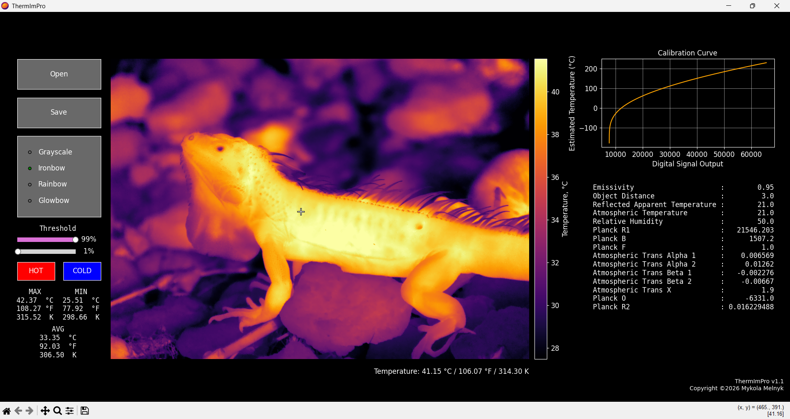

# ThermImPro (Thermal Image Processing)

A Python GUI tool for loading, viewing, and analyzing radiometric thermal images from FLIR cameras.

## Features

- Load radiometric thermal images
- View temperature values on hover
- Switch between four available color palettes
- Adjust temperature range
- Toggle hot and cold spots
- Display maximum, minimum, and average temperatures
- Save images with applied color palette
- Show calibration curve and metadata

## Installation

To install the tool, choose one of the following options:

**Download a release archive**

Download the appropriate archive from the Releases section and extract its contents.

Install [ExifTool](#exiftool).

**Install from source**

Download the source code and install Python (version 3.10 or higher).

Open a terminal or command prompt, navigate to the downloaded source directory, and run:

```
python -m pip install -r requirements.txt
```

Install [ExifTool](#exiftool).

On Linux, also install [Tkinter](#tkinter-linux) if it is not already installed.

### ExifTool

Download and install ExifTool from the link [below](#references).

Alternatively, use the appropriate command for your system.

Windows (WinGet):

```
winget install OliverBetz.ExifTool
```

Ubuntu/Debian:

```
sudo apt install libimage-exiftool-perl
```

Arch Linux:

```
sudo pacman -S perl-image-exiftool
```

**Note:** Ensure `exiftool` is added to your PATH environment variable.

### Tkinter (Linux)

Ubuntu/Debian:

```
sudo apt install python3-tk
```

Arch Linux:

```
sudo pacman -S tk
```

## Usage

On Windows run `thermimpro.exe`.

On Linux run `./thermimpro`.

If running from source, run `python main.py`.

## Build

You can use Nuitka to package the source code as a standalone executable.

Install Nuitka:

```
python -m pip install nuitka
```

Then run one of the following commands:

Windows:

```
python -m nuitka --mode=standalone --enable-plugin=tk-inter --include-data-file=icon.png=icon.png --windows-console-mode=disable --windows-icon-from-ico=icon.png --output-filename=thermimpro.exe main.py
```

Linux:

```
python -m nuitka --mode=standalone --enable-plugin=tk-inter --include-data-file=icon.png=icon.png --output-filename=thermimpro main.py
```

## Screenshots



| Grayscale                              | Ironbow                              | Rainbow                              | Glowbow                              |
| -------------------------------------- | ------------------------------------ | ------------------------------------ | ------------------------------------ |
|  |  |  |  |

## References

This application uses ExifTool by Phil Harvey. ExifTool is licensed under the Perl Artistic License.

ExifTool by Phil Harvey: https://exiftool.org/

The following resources were used while researching and developing this software.

tomas123. Re: Flir Ex: Realtime raw radiometric data streaming via UVC [Forum post]. EEVblog Electronics Community Forum  
https://www.eevblog.com/forum/thermal-imaging/flir-ex-realtime-raw-radiometric-data-streaming-via-uvc/msg744673

Josh Veitch-Michaelis. Radiometry [Documentation]. Flirpy  
https://flirpy.readthedocs.io/en/latest/getting_started/cameras.html

Glenn Tattersall. gtatters/Thermimage: Thermimage v4.1.3 [Documentation/Repository]. Zenodo  
https://doi.org/10.5281/zenodo.5525416

Glenn Tattersall. Iguana iguana [Image]. TrEnCh-IR  
https://trench-ir.azurewebsites.net/page?name=6204867555843852-Iguana_IR_2017-12-20_1478.jpg
